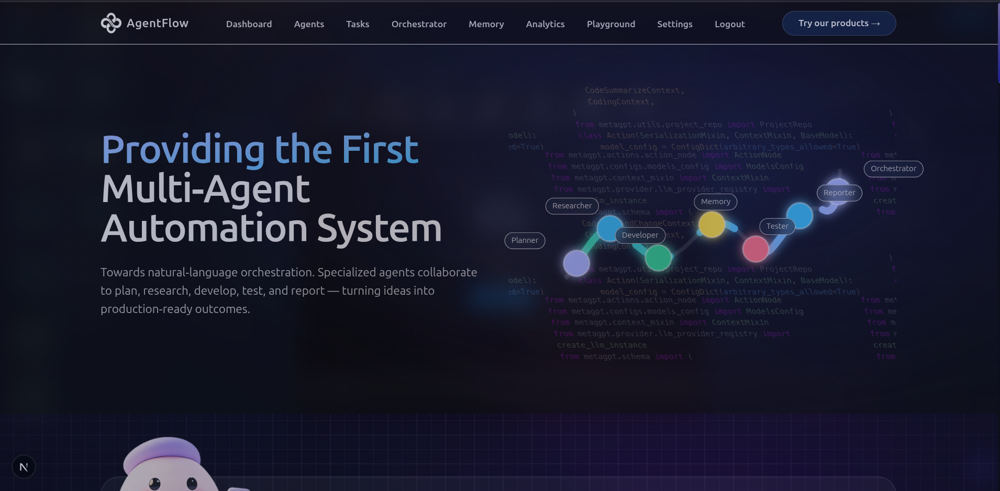

# AgentFlow


**The Next Generation Multi-Agent Task Automation System**

*Divide. Delegate. Dominate.*

[](https://nextjs.org/)
[](https://www.python.org/)
[](LICENSE)

[Demo](#demo) • [Features](#features) • [Architecture](#architecture) • [Getting Started](#getting-started) • [Documentation](#documentation)


---

## 🚀 Revolutionary Multi-Agent Task Automation Platform

AgentFlow is a cutting-edge multi-agent orchestration system that revolutionizes how complex tasks are handled. Unlike traditional single-agent chatbots, AgentFlow distributes workload across specialized AI agents that collaborate intelligently to deliver superior results.

**Built for the future of AI automation** — from software development to research, content creation to data analysis — all powered by coordinated agent teamwork.

---

## 📑 Contents

- [✨ Features](#-features)
- [🏗️ Architecture](#️-architecture)
- [🤖 Meet the Team](#-meet-the-team)
- [🔄 How It Works](#-how-it-works)
- [🛠️ Tech Stack](#️-tech-stack)
- [🚦 Getting Started](#-getting-started)
- [📊 Use Cases](#-use-cases)
- [🎯 Why AgentFlow?](#-why-agentflow)
- [📸 Demo](#-demo)
- [🤝 Contributing](#-contributing)

---

## ✨ Features

### 🎭 **Multi-Agent Collaboration**
Different agents specialize in specific domains and communicate seamlessly, mimicking real-world team dynamics for complex problem-solving.

- **Domain Specialization**: Each agent masters a specific skill (planning, coding, testing, research, reporting)
- **Inter-Agent Communication**: Agents share context, results, and coordinate on task execution
- **Parallel Processing**: Multiple agents work simultaneously on different subtasks
- **Intelligent Routing**: Tasks are automatically assigned to the most suitable agent

### 🧠 **Context Preservation & Memory**
Advanced memory management ensures agents remember previous interactions and maintain conversation context throughout the workflow.

- **Shared Memory Pool**: All agents access a unified knowledge base
- **Conversation History**: Full context awareness across all agent interactions
- **State Management**: Track progress, decisions, and results in real-time
- **Learning from Past Tasks**: Agents improve performance based on historical data

### 🔍 **Task Transparency & Trust**
Complete visibility into which agent performed what action, building user trust and enabling debugging.

- **Agent Activity Logs**: Track every action taken by each agent
- **Real-Time Updates**: See agent progress and status changes live
- **Result Attribution**: Know exactly which agent contributed what
- **Audit Trail**: Complete transparency for compliance and review

### 📈 **Scalability & Extensibility**
Add new specialized agents without redesigning the core system architecture.

- **Modular Design**: Plug-and-play agent architecture
- **Easy Agent Creation**: Define new agents with simple configuration
- **Dynamic Team Composition**: Adapt agent teams based on task requirements
- **No Core Rewrites**: Extend functionality without breaking existing workflows

### 🌐 **Automation Across Domains**
From coding to research, marketing to data analysis — all in one unified platform.

- **Software Development**: Full-stack code generation, testing, and deployment
- **Research & Analysis**: Web research, data gathering, and insight generation
- **Content Creation**: Writing, editing, and optimization
- **Business Operations**: Report generation, task planning, and workflow automation

---

## 🏗️ Architecture

```
┌─────────────────────────────────────────────────────────────┐
│                         User Input                          │
│                    (Complex Task Request)                   │
└─────────────────────────┬───────────────────────────────────┘
                          │
                          ▼
┌─────────────────────────────────────────────────────────────┐
│                  AgentFlow Orchestrator                     │
│              (Task Analysis & Distribution)                 │
└─────────────────────────┬───────────────────────────────────┘
                          │
            ┌─────────────┼─────────────┐
            │             │             │
            ▼             ▼             ▼
    ┌──────────┐  ┌──────────┐  ┌──────────┐
    │ PlanZilla│  │ QueryLyn │  │CodeWizard│
    │ Planner  │  │Researcher│  │Developer │
    └────┬─────┘  └────┬─────┘  └────┬─────┘
         │             │             │
         └─────────────┼─────────────┘
                       │
                       ▼
            ┌──────────────────────┐
            │   Shared Memory &    │
            │   Context Manager    │
            └──────────┬───────────┘
                       │
            ┌──────────┼──────────┐
            │                     │
            ▼                     ▼
    ┌──────────┐          ┌──────────┐
    │BugBuster │          │ DataBard │
    │ QA Tester│          │ Reporter │
    └────┬─────┘          └────┬─────┘
         │                     │
         └──────────┬──────────┘
                    │
                    ▼
        ┌───────────────────────┐
        │    Unified Output     │
        │  (Final Deliverable)  │
        └───────────────────────┘
```

---

## 🤖 Meet the Team

### 🎯 **PlanZilla** - Strategic Planner
> *"Breaking down complexity into actionable steps"*

- **Role**: Task decomposition and strategic planning
- **Capabilities**: Project roadmaps, milestone definition, resource allocation
- **Specialty**: Turning vague requirements into clear action plans

### 🔎 **QueryLyn** - Lead Researcher
> *"Finding the answers you didn't know you needed"*

- **Role**: Information gathering and research
- **Capabilities**: Web search, data collection, competitive analysis
- **Specialty**: Deep research and knowledge synthesis

### 💻 **CodeWizard** - Full-Stack Developer
> *"From concept to deployment in record time"*

- **Role**: Code generation and implementation
- **Capabilities**: Frontend, backend, database, API development
- **Specialty**: Clean, production-ready code across all stacks

### 🐛 **BugBuster** - QA Tester
> *"Quality is not an accident, it's a habit"*

- **Role**: Testing and quality assurance
- **Capabilities**: Unit tests, integration tests, bug detection
- **Specialty**: Ensuring reliability and catching edge cases

### 📊 **DataBard** - Insights Reporter
> *"Transforming data into compelling narratives"*

- **Role**: Analysis and reporting
- **Capabilities**: Data visualization, report generation, insights extraction
- **Specialty**: Making complex information accessible and actionable

---

## 🔄 How It Works

### Step 1: **Task Submission**
User submits a complex task through the AgentFlow interface.

```
Example: "Build a full-stack e-commerce platform with user authentication"
```

### Step 2: **Intelligent Decomposition**
**PlanZilla** analyzes the task and creates a structured execution plan:
- ✅ Define project architecture
- ✅ Research tech stack options
- ✅ Generate frontend components
- ✅ Build backend API
- ✅ Implement authentication
- ✅ Write test suites
- ✅ Generate documentation

### Step 3: **Parallel Execution**
Agents work simultaneously on their assigned subtasks:
- **QueryLyn** researches best practices and libraries
- **CodeWizard** generates frontend and backend code
- **BugBuster** writes and runs test cases
- **DataBard** prepares progress reports

### Step 4: **Context Sharing**
All agents access shared memory to:
- Reference previous decisions
- Avoid duplicate work
- Maintain consistency
- Build on each other's outputs

### Step 5: **Quality Assurance**
**BugBuster** validates all deliverables before final submission.

### Step 6: **Unified Delivery**
**DataBard** compiles everything into a comprehensive, user-friendly package.

---

## 🛠️ Tech Stack

### **Frontend**
- **Next.js 14+** - React framework with App Router
- **Tailwind CSS** - Utility-first styling
- **React Query** - Server state management
- **Zustand** - Client state management

### **Backend & AI Integration**
- **Python 3.10+** - AI orchestration layer
- **LangChain** - Agent framework and LLM orchestration
- **OpenAI API / Gemini** - Large language models
- **FastAPI** - High-performance Python backend
- **WebSockets** - Real-time agent communication

### **AI & ML Libraries**
- **LangChain** - Multi-agent coordination
- **ChromaDB** - Vector database for context storage
- **Pinecone** - Long-term memory management
- **Transformers** - NLP and embeddings

### **Infrastructure**
- **Vercel** - Frontend deployment
- **Railway / Render** - Backend hosting
- **Supabase** - Database and authentication
- **Redis** - Caching and session management

---

## 🚦 Getting Started

### Prerequisites

```bash
Node.js >= 18.x
Python >= 3.10
npm or yarn or pnpm
```

### Installation

1. **Clone the repository**
```bash
git clone https://github.com/yourusername/agentflow.git
cd agentflow
```

2. **Install frontend dependencies**
```bash
npm install
# or
yarn install
# or
pnpm install
```

3. **Set up Python environment**
```bash
cd backend
python -m venv venv
source venv/bin/activate  # On Windows: venv\Scripts\activate
pip install -r requirements.txt
```

4. **Configure environment variables**
```bash
# Frontend (.env.local)
NEXT_PUBLIC_API_URL=http://localhost:8000
NEXT_PUBLIC_SUPABASE_URL=your_supabase_url
NEXT_PUBLIC_SUPABASE_ANON_KEY=your_supabase_key

# Backend (.env)
OPENAI_API_KEY=your_openai_key
PINECONE_API_KEY=your_pinecone_key
DATABASE_URL=your_database_url
```

5. **Run the development servers**

Frontend:
```bash
npm run dev
```

Backend:
```bash
cd backend
uvicorn main:app --reload
```

6. **Access the application**
```
http://localhost:3000
```

---

## 📊 Use Cases

### 🖥️ **Software Development**
- Full-stack application generation
- Code review and optimization
- Test-driven development
- Documentation generation

### 📈 **Business Intelligence**
- Market research and analysis
- Competitor intelligence gathering
- Data-driven insights and reporting
- Trend analysis and forecasting

### ✍️ **Content Creation**
- Blog post generation with SEO optimization
- Technical documentation
- Marketing copy and social media content
- Multi-language translation

### 🔬 **Research & Analysis**
- Academic research assistance
- Literature reviews
- Data collection and synthesis
- Citation management

### ⚙️ **Workflow Automation**
- Email management and responses
- Task scheduling and prioritization
- Report generation
- Data entry and processing

---

## 🎯 Why AgentFlow?

### vs. **Single-Agent Systems**

| Feature | Traditional AI | AgentFlow |
|---------|---------------|-----------|
| **Task Handling** | Sequential, limited scope | Parallel, complex workflows |
| **Specialization** | Generalist approach | Domain experts |
| **Scalability** | Limited by single model | Infinitely extensible |
| **Quality** | One-size-fits-all | Best-in-class per domain |
| **Transparency** | Black box | Full visibility |
| **Context** | Short-term memory | Persistent, shared memory |

### Key Differentiators

✅ **Domain Expertise**: Each agent is optimized for specific tasks  
✅ **Collaboration**: Agents work together like human teams  
✅ **Transparency**: Clear visibility into decision-making  
✅ **Scalability**: Add agents without system rewrites  
✅ **Quality**: Specialized agents deliver superior results  
✅ **Flexibility**: Adapt to any domain or use case  

---

## 📸 Demo

### Agent Dashboard


### Agents Team


### Why AgentFlow ?
*

> 📹 **[Watch Full Demo Video](#)** | 🌐 **[Try Live Demo](#)**

---

## 🤝 Contributing

We welcome contributions! Please see our [Contributing Guidelines](CONTRIBUTING.md) for details.

1. Fork the repository
2. Create your feature branch (`git checkout -b feature/AmazingFeature`)
3. Commit your changes (`git commit -m 'Add some AmazingFeature'`)
4. Push to the branch (`git push origin feature/AmazingFeature`)
5. Open a Pull Request

---

## 📄 License

This project is licensed under the MIT License - see the [LICENSE](LICENSE) file for details.

---

## 🙏 Acknowledgments

- **OpenAI** for GPT models
- **LangChain** for agent orchestration framework
- **Vercel** for hosting and deployment
- **All contributors** who make this project possible

---

## 📞 Contact & Support

- **Author**: Your Name
- **Email**: your.email@example.com
- **LinkedIn**: [Your LinkedIn Profile](#)
- **Project Link**: [https://github.com/yourusername/agentflow](https://github.com/yourusername/agentflow)

---

=

**Built with ❤️ for the AI Revolution**

⭐ **Star this repo if you find it useful!** ⭐

[Report Bug](https://github.com/yourusername/agentflow/issues) • [Request Feature](https://github.com/yourusername/agentflow/issues) • [Documentation](#)
